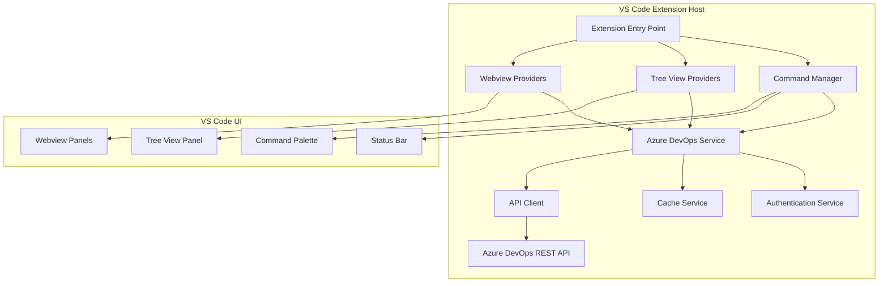

# Design Document

## Overview

The Azure Pipelines Assistant is a VS Code extension that provides comprehensive Azure DevOps pipeline management capabilities directly within the editor. The extension follows a modular architecture with clear separation of concerns between data providers, services, and UI components. It leverages VS Code's extension APIs for tree views, webviews, and secure storage while maintaining compatibility across VS Code, Cursor, and Windsurf IDEs.

## Architecture

### High-Level Architecture



### Extension Activation

The extension activates when:
- VS Code starts (if previously configured)
- User opens the Azure Pipelines view
- User executes any Azure Pipelines command

### Data Flow

1. **Authentication**: User provides organization and PAT through settings
2. **Data Fetching**: Services fetch data from Azure DevOps API with caching
3. **UI Updates**: Tree providers and webviews update based on data changes
4. **User Actions**: Commands trigger API calls and UI updates

## Components and Interfaces

### Core Services

#### Azure DevOps Service
```typescript
interface IAzureDevOpsService {
  // Project and Pipeline Management
  getProjects(): Promise<Project[]>;
  getPipelines(projectId: string): Promise<Pipeline[]>;
  getPipelineRuns(pipelineId: number, projectId: string): Promise<PipelineRun[]>;
  
  // Run Management
  triggerPipelineRun(pipelineId: number, projectId: string, parameters: RunParameters): Promise<PipelineRun>;
  getRunDetails(runId: number, pipelineId: number, projectId: string): Promise<PipelineRunDetails>;
  cancelRun(runId: number, pipelineId: number, projectId: string): Promise<void>;
  
  // Logs and Artifacts
  getRunLogs(runId: number, projectId: string): Promise<LogEntry[]>;
  downloadArtifacts(runId: number, projectId: string): Promise<Blob>;
  
  // Real-time Updates
  subscribeToRunUpdates(runId: number, callback: (run: PipelineRun) => void): Disposable;
}
```

#### Authentication Service
```typescript
interface IAuthenticationService {
  validateCredentials(organization: string, pat: string): Promise<ValidationResult>;
  getStoredCredentials(): Promise<Credentials | null>;
  storeCredentials(credentials: Credentials): Promise<void>;
  clearCredentials(): Promise<void>;
  isAuthenticated(): boolean;
}

interface ValidationResult {
  isValid: boolean;
  permissions: Permission[];
  missingPermissions: Permission[];
  errorMessage?: string;
}
```

#### Cache Service
```typescript
interface ICacheService {
  get<T>(key: string): T | null;
  set<T>(key: string, value: T, ttl?: number): void;
  invalidate(key: string): void;
  clear(): void;
  
  // Specialized cache methods
  getCachedProjects(): Project[] | null;
  setCachedProjects(projects: Project[]): void;
  getCachedPipelines(projectId: string): Pipeline[] | null;
  setCachedPipelines(projectId: string, pipelines: Pipeline[]): void;
}
```

### Tree View Providers

#### Pipeline Tree Provider
```typescript
class PipelineTreeProvider implements vscode.TreeDataProvider<TreeItem> {
  private _onDidChangeTreeData = new vscode.EventEmitter<TreeItem | undefined>();
  readonly onDidChangeTreeData = this._onDidChangeTreeData.event;
  
  constructor(
    private azureDevOpsService: IAzureDevOpsService,
    private authService: IAuthenticationService
  ) {}
  
  getTreeItem(element: TreeItem): vscode.TreeItem {
    // Return tree item with appropriate icons, labels, and context values
  }
  
  getChildren(element?: TreeItem): Promise<TreeItem[]> {
    // Return hierarchical structure: Projects → Pipelines → Runs
  }
  
  refresh(): void {
    this._onDidChangeTreeData.fire(undefined);
  }
}
```

#### Tree Item Types
```typescript
abstract class TreeItem {
  constructor(
    public readonly label: string,
    public readonly collapsibleState: vscode.TreeItemCollapsibleState
  ) {}
}

class ProjectTreeItem extends TreeItem {
  constructor(public readonly project: Project) {
    super(project.name, vscode.TreeItemCollapsibleState.Collapsed);
    this.contextValue = 'project';
    this.iconPath = new vscode.ThemeIcon('folder');
  }
}

class PipelineTreeItem extends TreeItem {
  constructor(public readonly pipeline: Pipeline) {
    super(pipeline.name, vscode.TreeItemCollapsibleState.Collapsed);
    this.contextValue = 'pipeline';
    this.iconPath = new vscode.ThemeIcon('gear');
  }
}

class RunTreeItem extends TreeItem {
  constructor(public readonly run: PipelineRun) {
    super(`Run #${run.id} - ${run.result}`, vscode.TreeItemCollapsibleState.None);
    this.contextValue = 'run';
    this.iconPath = this.getStatusIcon(run.result);
  }
  
  private getStatusIcon(result: string): vscode.ThemeIcon {
    switch (result) {
      case 'succeeded': return new vscode.ThemeIcon('check', new vscode.ThemeColor('testing.iconPassed'));
      case 'failed': return new vscode.ThemeIcon('error', new vscode.ThemeColor('testing.iconFailed'));
      case 'canceled': return new vscode.ThemeIcon('circle-slash', new vscode.ThemeColor('testing.iconSkipped'));
      default: return new vscode.ThemeIcon('clock');
    }
  }
}
```

### Webview Providers

#### Run Details Webview
```typescript
class RunDetailsWebviewProvider {
  private panel: vscode.WebviewPanel | undefined;
  
  constructor(
    private context: vscode.ExtensionContext,
    private azureDevOpsService: IAzureDevOpsService
  ) {}
  
  public async showRunDetails(run: PipelineRun): Promise<void> {
    if (this.panel) {
      this.panel.reveal();
    } else {
      this.panel = vscode.window.createWebviewPanel(
        'runDetails',
        `Run #${run.id} Details`,
        vscode.ViewColumn.One,
        {
          enableScripts: true,
          retainContextWhenHidden: true
        }
      );
    }
    
    this.panel.webview.html = await this.getWebviewContent(run);
    this.setupWebviewMessageHandling();
  }
  
  private async getWebviewContent(run: PipelineRun): Promise<string> {
    const runDetails = await this.azureDevOpsService.getRunDetails(run.id, run.pipeline.id, run.pipeline.project.id);
    return this.generateHtml(runDetails);
  }
}
```

#### Log Viewer Webview
```typescript
class LogViewerWebviewProvider {
  public async showLogs(runId: number, projectId: string): Promise<void> {
    const logs = await this.azureDevOpsService.getRunLogs(runId, projectId);
    
    const panel = vscode.window.createWebviewPanel(
      'logViewer',
      `Pipeline Logs - Run #${runId}`,
      vscode.ViewColumn.Two,
      {
        enableScripts: true,
        enableFindWidget: true
      }
    );
    
    panel.webview.html = this.generateLogHtml(logs);
  }
  
  private generateLogHtml(logs: LogEntry[]): string {
    // Generate HTML with syntax highlighting, filtering, and search capabilities
  }
}
```

## Data Models

### Core Models
```typescript
interface Project {
  id: string;
  name: string;
  description?: string;
  url: string;
  state: 'wellFormed' | 'createPending' | 'deleting' | 'new';
  visibility: 'private' | 'public';
}

interface Pipeline {
  id: number;
  name: string;
  project: Project;
  folder?: string;
  revision: number;
  url: string;
  configuration: {
    type: 'yaml' | 'designerJson';
    path: string;
    repository: Repository;
  };
}

interface PipelineRun {
  id: number;
  name: string;
  state: 'completed' | 'inProgress' | 'cancelling' | 'cancelled';
  result?: 'succeeded' | 'failed' | 'canceled' | 'abandoned';
  createdDate: Date;
  finishedDate?: Date;
  pipeline: Pipeline;
  resources: RunResources;
  variables: Record<string, Variable>;
  url: string;
}

interface PipelineRunDetails extends PipelineRun {
  stages: Stage[];
  timeline: TimelineRecord[];
  logs: LogReference[];
}

interface Stage {
  id: string;
  name: string;
  displayName: string;
  state: 'completed' | 'inProgress' | 'pending' | 'skipped';
  result?: 'succeeded' | 'failed' | 'canceled' | 'abandoned';
  startTime?: Date;
  finishTime?: Date;
  jobs: Job[];
  dependsOn: string[];
}

interface Job {
  id: string;
  name: string;
  displayName: string;
  state: 'completed' | 'inProgress' | 'pending' | 'skipped';
  result?: 'succeeded' | 'failed' | 'canceled' | 'abandoned';
  startTime?: Date;
  finishTime?: Date;
  agentName?: string;
  tasks: Task[];
}

interface Task {
  id: string;
  name: string;
  displayName: string;
  state: 'completed' | 'inProgress' | 'pending' | 'skipped';
  result?: 'succeeded' | 'failed' | 'canceled' | 'abandoned';
  startTime?: Date;
  finishTime?: Date;
  logId?: number;
  errorCount: number;
  warningCount: number;
  issues: Issue[];
}
```

### Configuration Models
```typescript
interface ExtensionConfiguration {
  organization: string;
  pat: string;
  refreshInterval: number;
  maxRunsPerPipeline: number;
  showTimestamps: boolean;
  favoriteProjects: string[];
  autoRefresh: boolean;
}

interface RunParameters {
  sourceBranch?: string;
  variables?: Record<string, string>;
  templateParameters?: Record<string, any>;
}
```

## Error Handling

### Error Types and Handling Strategy

#### Authentication Errors
```typescript
class AuthenticationError extends Error {
  constructor(
    message: string,
    public readonly errorCode: 'INVALID_PAT' | 'EXPIRED_PAT' | 'INSUFFICIENT_PERMISSIONS'
  ) {
    super(message);
  }
}

// Error handling in services
async function handleAuthenticationError(error: AuthenticationError): Promise<void> {
  switch (error.errorCode) {
    case 'INVALID_PAT':
      await vscode.window.showErrorMessage(
        'Invalid Personal Access Token. Please check your configuration.',
        'Configure'
      ).then(selection => {
        if (selection === 'Configure') {
          vscode.commands.executeCommand('azurePipelinesAssistant.configure');
        }
      });
      break;
    case 'EXPIRED_PAT':
      await vscode.window.showWarningMessage(
        'Your Personal Access Token has expired. Please update your configuration.',
        'Update Token'
      );
      break;
    case 'INSUFFICIENT_PERMISSIONS':
      await vscode.window.showErrorMessage(
        `Insufficient permissions. Required: ${error.message}`,
        'View Documentation'
      );
      break;
  }
}
```

#### Network and API Errors
```typescript
class NetworkError extends Error {
  constructor(
    message: string,
    public readonly statusCode?: number,
    public readonly retryable: boolean = true
  ) {
    super(message);
  }
}

// Retry logic with exponential backoff
async function withRetry<T>(
  operation: () => Promise<T>,
  maxRetries: number = 3,
  baseDelay: number = 1000
): Promise<T> {
  let lastError: Error;
  
  for (let attempt = 0; attempt <= maxRetries; attempt++) {
    try {
      return await operation();
    } catch (error) {
      lastError = error as Error;
      
      if (attempt === maxRetries || !(error instanceof NetworkError) || !error.retryable) {
        throw error;
      }
      
      const delay = baseDelay * Math.pow(2, attempt);
      await new Promise(resolve => setTimeout(resolve, delay));
    }
  }
  
  throw lastError!;
}
```

#### Data Validation Errors
```typescript
class DataValidationError extends Error {
  constructor(
    message: string,
    public readonly field: string,
    public readonly receivedValue: any
  ) {
    super(message);
  }
}

// Safe data parsing with fallbacks
function parseApiResponse<T>(response: any, schema: Schema<T>): T {
  try {
    return schema.parse(response);
  } catch (error) {
    console.warn('API response validation failed:', error);
    return schema.getDefault();
  }
}
```

## Testing Strategy

### Unit Testing
- **Services**: Mock Azure DevOps API responses and test business logic
- **Providers**: Test tree data provider logic with mock data
- **Utilities**: Test formatting, caching, and helper functions
- **Models**: Test data model validation and transformation

### Integration Testing
- **API Integration**: Test actual Azure DevOps API calls with test organization
- **Extension Activation**: Test extension lifecycle and command registration
- **Webview Integration**: Test webview creation and message passing

### End-to-End Testing
- **User Workflows**: Test complete user scenarios from authentication to pipeline execution
- **Cross-IDE Compatibility**: Test functionality across VS Code, Cursor, and Windsurf
- **Error Scenarios**: Test error handling and recovery mechanisms

### Test Structure
```typescript
// Example unit test
describe('AzureDevOpsService', () => {
  let service: AzureDevOpsService;
  let mockApiClient: jest.Mocked<ApiClient>;
  
  beforeEach(() => {
    mockApiClient = createMockApiClient();
    service = new AzureDevOpsService(mockApiClient);
  });
  
  describe('getPipelines', () => {
    it('should return cached pipelines when available', async () => {
      // Test implementation
    });
    
    it('should fetch from API when cache is expired', async () => {
      // Test implementation
    });
    
    it('should handle API errors gracefully', async () => {
      // Test implementation
    });
  });
});
```

### Performance Testing
- **Memory Usage**: Monitor memory consumption with large datasets
- **API Response Times**: Measure and optimize API call performance
- **UI Responsiveness**: Ensure UI remains responsive during data loading
- **Cache Effectiveness**: Validate cache hit rates and performance improvements

## Security Considerations

### Token Security
- **Secure Storage**: Use VS Code's `SecretStorage` API for PAT storage
- **Token Validation**: Validate token permissions before storing
- **Token Rotation**: Support updating expired tokens without data loss

### API Security
- **HTTPS Only**: All API calls use HTTPS
- **Request Validation**: Validate all API requests and responses
- **Rate Limiting**: Respect Azure DevOps API rate limits
- **Error Information**: Avoid exposing sensitive information in error messages

### Data Privacy
- **Local Storage**: Minimize data stored locally
- **Cache Expiration**: Implement appropriate cache TTL values
- **Data Cleanup**: Clean up cached data on extension deactivation

## Performance Optimization

### Caching Strategy
```typescript
class CacheService implements ICacheService {
  private cache = new Map<string, CacheEntry>();
  private readonly DEFAULT_TTL = 5 * 60 * 1000; // 5 minutes
  
  set<T>(key: string, value: T, ttl: number = this.DEFAULT_TTL): void {
    this.cache.set(key, {
      value,
      expiry: Date.now() + ttl
    });
  }
  
  get<T>(key: string): T | null {
    const entry = this.cache.get(key);
    if (!entry || Date.now() > entry.expiry) {
      this.cache.delete(key);
      return null;
    }
    return entry.value as T;
  }
}
```

### Lazy Loading
- **Tree View**: Load pipeline details only when expanded
- **Run Details**: Fetch comprehensive run data only when requested
- **Logs**: Load logs on-demand with pagination
- **Artifacts**: Download artifacts only when explicitly requested

### Background Updates
- **Polling**: Background polling for active pipeline runs
- **Incremental Updates**: Use API timestamps for incremental data fetching
- **Smart Refresh**: Refresh only changed data based on user activity

### Memory Management
- **Event Listeners**: Proper disposal of event listeners and subscriptions
- **Webview Cleanup**: Clean up webview resources when panels are closed
- **Cache Limits**: Implement cache size limits and LRU eviction
- **Resource Monitoring**: Monitor and log memory usage patterns